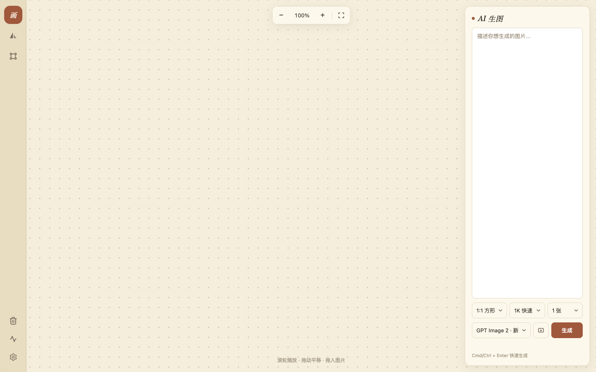
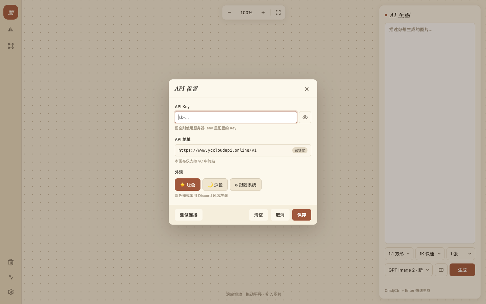
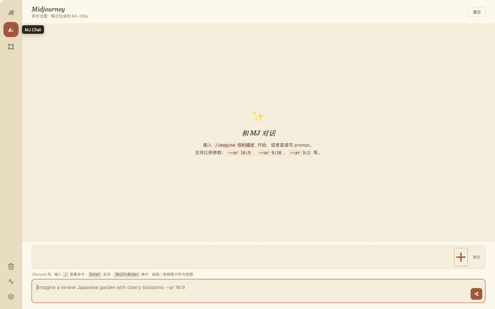
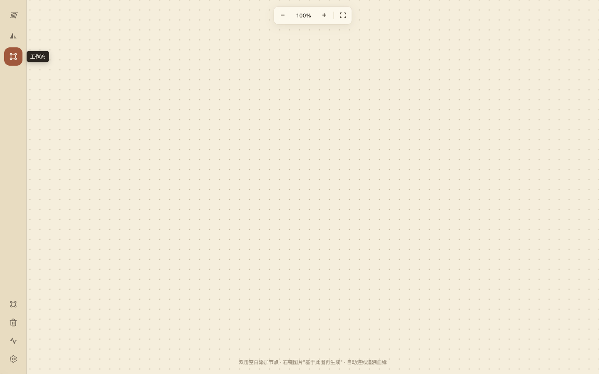
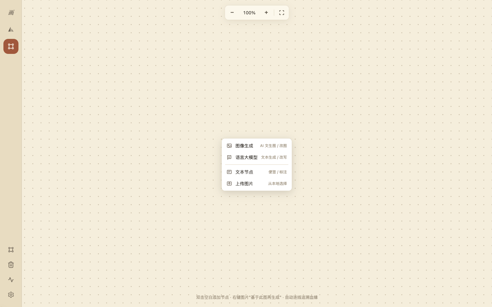
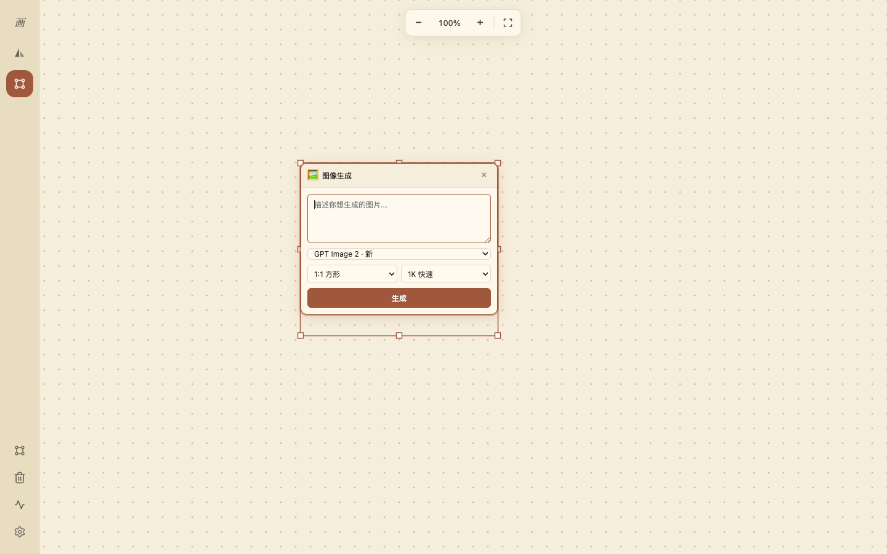
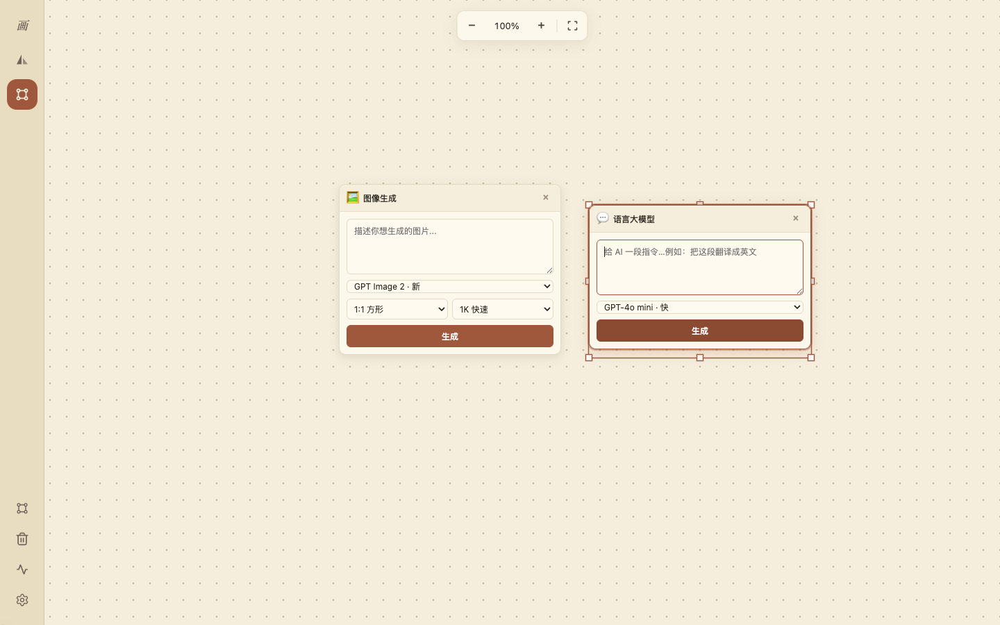
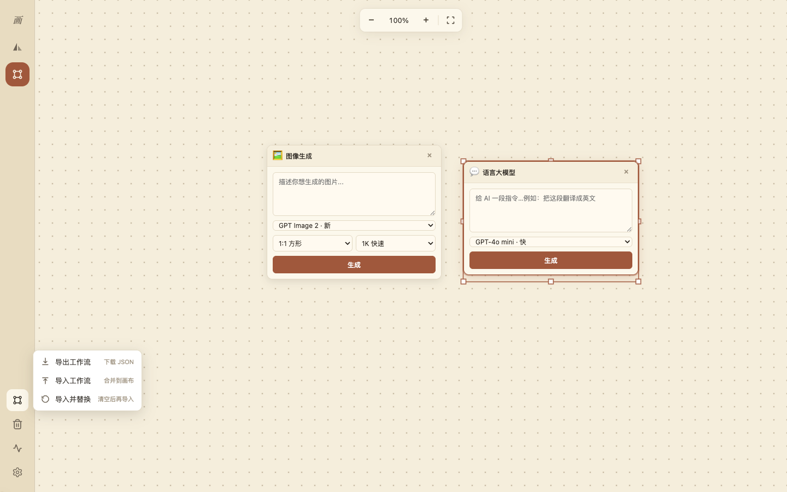

# 新手完整指南 · 从零开始用 Canvas-AI

> 本指南面向**完全没用过这类工具的小白**，从注册账号开始一步一步教你跑通整个流程。
> 全程预计 **10-15 分钟**，跟着做一定能出图。

---

## 📋 你将学会

1. ✅ 注册 yC API 中转站账号
2. ✅ 充值并生成 API Key
3. ✅ 下载并安装 Canvas-AI 桌面应用
4. ✅ 在软件里绑定 API Key
5. ✅ 用三种模式生成第一张图

---

# Part 1 · 注册 yC API 中转站

Canvas-AI 本身不带 AI 能力 —— 它是个**前端工具**，需要连一个 **AI API 服务**来真正跑模型。我们推荐用我们自营的 **yC API 中转站**：国内直连免代理、模型最多、按量计费。

## 1.1 打开注册页

浏览器访问：**[https://www.yccloudapi.online](https://www.yccloudapi.online)**

页面右上角有「**登录**」按钮，点击进入登录页 → 登录页底部有「**点击注册**」/「**没有账号？立即注册**」链接，点进去。

> 💡 yC API 后台用的是开源的 [New API](https://github.com/Calcium-Ion/new-api) 框架，下面所有截图和操作都是这个框架的标准流程。

## 1.2 填写注册信息

注册页通常需要：

| 字段 | 说明 |
|------|------|
| **用户名** | 4-12 位英文/数字，登录时用 |
| **密码** | 8 位以上，含字母数字 |
| **确认密码** | 重复一遍 |
| **邮箱** | 用于找回密码、接收账单 |
| **邮箱验证码** | 点「获取验证码」→ 邮箱里收 6 位数字 → 填进来 |
| **邀请码**（可选） | 如果有人给你发了邀请码，填进去通常会送额度；没有可空着 |

填完点「**注册**」按钮 → 提示注册成功 → 自动跳转到登录页 → 用刚才的用户名+密码登录。

## 1.3 进入个人中心

登录成功后，左侧菜单栏会看到：

```
📊 概览
🎫 令牌（API Key 在这里）
💰 钱包（充值在这里）
📜 日志
🎁 兑换码
🔔 公告
👤 个人设置
📖 文档
```

第一次进来余额是 **0 元**，需要充值才能用。

---

# Part 2 · 充值 + 生成 API Key

## 2.1 充值（推荐先充 ¥10 试用）

1. 左侧菜单点「**钱包**」或「**充值**」
2. 选金额（建议先充 ¥10 试试水，跑几张 GPT Image 是没问题的）
3. 选支付方式：**微信支付** / **支付宝** / **USDT**（视具体配置）
4. 扫码支付 → 后台余额几秒内到账

> 💡 **新人福利**：注册后通常会有少量赠送额度（看站长配置），可以先白嫖一两张图试试。
>
> 💡 **价格参考**（实际以官网为准）：
> - GPT Image 1 一张约 ¥0.10
> - Flux Schnell 一张约 ¥0.05
> - Seedream 4.0 一张约 ¥0.15
> - MJ Imagine 一组 4 图约 ¥0.50
> - Claude Sonnet 4.5 每千 token ¥0.025

## 2.2 生成 API Key（关键步骤）

1. 左侧菜单点「**令牌**」
2. 点页面右上角「**添加新令牌**」/「**新建令牌**」按钮
3. 弹窗里填：
   - **令牌名称**：随意，比如 `Canvas-AI`
   - **额度**：选「**无限额度**」最方便（用多少扣多少）
   - **过期时间**：选「**永不过期**」
   - **可用模型**：选「**全部模型**」
   - **IP 限制**：留空
4. 点「**提交**」
5. 列表里出现新令牌 → 点「**复制**」按钮 → **以 `sk-` 开头的一长串字符**就是你的 API Key
   - 形如：`sk-Xxx...YyYy`（约 50 个字符）

⚠️ **重要安全提示**：
- 这个 Key **等同于你的钱包**，泄露了别人能花你的钱
- 不要发到群、不要 push 到公开仓库、不要写在博客里
- 只粘贴到 Canvas-AI 的设置框里，**它只存在你本机**不上传任何地方

---

# Part 3 · 下载并安装 Canvas-AI

## 3.1 选择安装包

到 GitHub Releases 页下载：**[https://github.com/betzaydarobie-source/Canvas-AI/releases](https://github.com/betzaydarobie-source/Canvas-AI/releases)**

| 你的电脑 | 下载这个 |
|---------|---------|
| **macOS（Apple M 芯片：M1/M2/M3/M4）** | `无限画布-1.0.3-arm64.dmg`（91 MB） |
| **macOS（Intel 芯片）** | `无限画布-1.0.3-x64.dmg`（98 MB） |
| **Windows 安装版（推荐）** | `无限画布-Setup-1.0.3.exe`（75 MB） |
| **Windows 免安装版** | `无限画布-Portable-1.0.3.exe`（75 MB） |

> 怎么看自己 Mac 是什么芯片？点左上角  → 关于本机 → 看「芯片」那一栏。
> Windows 的话两个版本都行，安装版会创建快捷方式，便携版双击直接跑。

## 3.2 安装步骤

### macOS

1. 双击 dmg → 把「无限画布」图标拖到「Applications」文件夹
2. 打开 Launchpad → 找到「无限画布」→ 点击
3. **第一次打开提示「已损坏，无法打开」？**
   - 这是 macOS Gatekeeper 的安全机制（不是真的损坏）
   - 打开「终端」（Cmd+空格 → 搜「终端」→ 回车）
   - 粘贴这条命令，回车，输入开机密码：
     ```bash
     sudo xattr -rd com.apple.quarantine /Applications/无限画布.app
     ```
   - 命令跑完后再打开就正常了

### Windows

1. 双击 exe 文件 → 一路下一步 → 完成
2. **不能用微信/QQ 传 exe 文件给朋友！** 微信会自动压缩破坏 exe 二进制，导致安装时报「NSIS integrity check has failed」错误
3. 朋友间分发请用：U 盘 / 网盘（百度网盘、阿里云盘）/ WeTransfer / 邮件附件

---

# Part 4 · 在 Canvas-AI 里绑定 API Key

打开 Canvas-AI 后是这个界面（第一次打开是空画布）：



## 4.1 点左下齿轮 ⚙️ 打开设置

左下角从下到上 4 个图标：
- ⚙️ 设置 ← **点这个**
- 📊 诊断
- 🗑️ 清空
- ⊞ 工作流（仅工作流模式可见）

点齿轮后弹出 API 设置框：



## 4.2 粘贴 API Key

1. 在「**API Key**」输入框里**粘贴**刚才从 yC API 复制的 `sk-` 开头的 Key
2. 「**API 地址**」已经锁定为 `https://www.yccloudapi.online/v1`，**不用改**
3. 点左下角「**测试连接**」按钮
   - ✅ 显示「连接成功 · 模型数：30+」→ Key 有效
   - ❌ 显示其他报错 → 检查 Key 是否完整复制，或回 yC API 后台确认令牌状态
4. 点右下角「**保存**」按钮

主题可以在这里切（浅色 / 深色 / 跟随系统）—— 截图里都用的浅色。

完成！现在可以开始生图了。

---

# Part 5 · 第一次生成图片（三种玩法）

软件支持三种模式，左侧 rail 切换：

| 图标 | 模式 | 适合谁 |
|------|------|------|
| 🖌️「画」 | **无限画布** | 第一次用、随手生图 |
| 🐦 双帆船 | **MJ Chat** | 习惯 Discord 命令风格 |
| 🔗 4 圆点 | **工作流** | 想做多步骤创作流程的设计师 |

## 5.1 模式一：无限画布（最简单）

界面右侧是 AI 生图面板：


**操作 5 步：**
1. **写 prompt**：在大文本框里写你想生成的内容（中英文都行）
   - 例：`一只穿着红色斗篷的金毛犬，水彩风格，温暖光线`
2. **选模型**：点底部「GPT Image 2」下拉 → 选你想要的模型
   - 入门推荐：`Flux Schnell`（快、便宜）/ `GPT Image 2`（综合质量好）
3. **选比例**：`1:1 方形` / `16:9 横版` / `9:16 竖版` 等
4. **选清晰度**：`1K 快速` / `2K 推荐` / `4K 超清`（不同模型支持档不一样，会自动锁）
5. **点「生成」按钮**（或 **Cmd/Ctrl + Enter**）

→ 画布上立刻出现一个**虚线占位框**，几秒到几十秒后图片出现在框里。

**鼠标操作**：
- 拖动空白：平移画布
- 滚轮：以鼠标位置缩放
- 单击图片：选中（出现选择框）
- 右键图片：弹菜单（设为参考图、画笔标注、放大、下载、删除）

## 5.2 模式二：MJ Chat（命令式）

切到第二个 rail 图标 → 进入 Discord 风格界面：



输入框里输入 `/` 会弹出 25 条官方命令。最常用：

```
/imagine 一片樱花林，黄昏，电影感 --ar 16:9
```

按 **Enter** 发送。

返回的是 **2×2 拼图** + 8 个动作按钮：
- **U1/U2/U3/U4** —— 选这一格做高清放大
- **V1/V2/V3/V4** —— 选这一格做变体（保留风格、内容微变）
- **🔄** —— 全部重画
- **Vary Region** —— 涂抹一块区域 + 写描述局部修改

> 想把 MJ 出的图带到无限画布里继续编辑？双击图片就行。

## 5.3 模式三：工作流（设计师专用）

切到第三个 rail 图标（4 圆点） → 画布**完全空白**：



> 工作流是 ComfyUI 风的节点式编辑器 —— 每个生成任务是一个独立的节点卡片，可以拼接成复杂创作流程。

### 5.3.1 添加节点

**双击空白处**任意位置 → 弹出 4 选项菜单：



| 选项 | 作用 |
|------|------|
| 🖼️ **图像生成** | 添加 AI 文生图节点 |
| 💬 **语言大模型** | 添加 GPT/Claude/Gemini 文本节点 |
| 📝 **文本节点** | 添加便签（写 prompt 草稿、做标注） |
| ↑ **上传图片** | 从本地选图加到画布 |

### 5.3.2 图像生成节点

点「图像生成」→ 一张**带表单的卡片**出现在双击位置：



- 卡片头部 `🖼️ 图像生成` 那一行 → 按住可拖动整张卡片
- 中间大文本框 → 写你的 prompt
- 下面三个下拉 → 模型 / 比例 / 清晰度
- 红色「生成」按钮 → 触发 AI 生成
- 右上角 × → 删除节点

**关键玩法**：点「生成」后，**这张卡片本身**会变成生成出来的图片（卡片表单消失，图片占据原位）。

### 5.3.3 多节点协同

可以在画布上同时摆好几个节点，每个独立配置：



上图：左边一个图像生成节点（GPT Image 2 + 1:1）+ 右边一个语言大模型节点（GPT-4o mini）。

### 5.3.4 自动连线（工作流的灵魂）

1. 选中画布上一张已有图
2. 右键 → **「✨ 基于此图再生成」**
3. 一个**新的图像生成节点**自动出现在源图右侧，源图已被预设为它的输入
4. 写新 prompt → 点生成
5. **新图自动用一条暖橙色弧线连回源图** —— 形成可视化的"创作血缘"

这就是工作流模式的核心：你看到的不再是一堆散乱图片，而是一棵有上下游关系的"创作树"。

### 5.3.5 工作流导出 / 导入

辛苦做的工作流想备份或发给朋友？点左下角的 ⊞ 工作流按钮：



- ↓ **导出工作流** —— 下载 JSON（包含所有节点 + 连线 + 图片 base64）
- ↑ **导入工作流** —— 选 JSON 文件，**合并**到当前画布
- ⟲ **导入并替换** —— 清空当前画布后导入

---

# Part 6 · 常见问题

### Q1: 测试连接显示「401 Unauthorized」/「无效的 API Key」
**A**: 几个排查方向：
1. Key 是否复制完整（包括开头的 `sk-`，最后一位也别漏）
2. 回 yC API 后台「令牌」页 → 看这个令牌状态是否还是「正常」
3. 余额是否 > 0（充值才能用）

### Q2: 生成图片时显示「上游错误」
**A**: 点左下角 💓 诊断图标 → 看最近一条失败请求 → 复制响应文本能看到具体报错原因（额度不足 / 模型下架 / 内容被风控等）

### Q3: 我选了 GPT Image 2 + 4K 但出来的图很小
**A**: GPT Image 系列原生只支持 1024² / 1536×1024 / 1024×1536 三种尺寸，后端会把任何高分辨率请求 snap 到这 3 种。**真要 4K 输出，用 Seedream 4.0+。**

### Q4: 想看每张图的 prompt 和模型
**A**:
- 工作流模式下，缩放到 ≥ 55% 时图片顶部会浮出一条小标签显示模型名
- 或右键图片 → 看 meta 信息（暂不开放，可改诊断面板复制原始请求）

### Q5: 想清空画布重新开始
**A**: 左下角 🗑️ 垃圾桶图标 → 点 → 确认 → 全部清空。**重要内容请先用工作流的「导出」功能备份**，删了不可恢复。

### Q6: 怎么节省成本
**A**: 几个技巧：
1. 写 prompt 阶段用便宜的模型（Flux Schnell / Z Image Turbo）多试，确定方向后再用贵模型出最终版
2. 在 yC API 后台开「**模型限速**」，避免误操作刷高额度
3. 用 LLM 节点帮你扩展 prompt，比自己反复试图更便宜
4. 工作流 JSON 备份，别让重要工作流被无意清空导致重做

### Q7: yC API 还支持哪些 Canvas-AI 没列出来的模型
**A**: yC API 全模型列表在他们后台「文档」页面，包括：
- 文本：GPT-5 / Claude Opus 4.5 / Gemini 2.5 Pro / DeepSeek-Reasoner / Kimi K2 等
- 图像：所有 Flux / Stable Diffusion 系列 / DALL·E（已下架）/ Sora 视频帧等
- 视频：Sora 2 / VEO 3.1 / Kling O1（这些 Canvas-AI 暂未集成 UI，但 API 可用）
- 音频：TTS / Whisper

---

# Part 7 · 下一步

入门了之后可以看：

- 📖 **完整使用手册** ：[使用说明.md](./使用说明.md) —— 详细到每个按钮每个快捷键
- 🐦 **MJ 25 条命令详解** ：使用说明.md 的「模式二：MJ Chat」章节
- 🔗 **工作流高级用法** ：使用说明.md 的「模式三：工作流」章节
- 🛠️ **API 调用文档** ：[https://www.yccloudapi.online](https://www.yccloudapi.online) → 登录后看「文档」页
- 🐛 **Bug 反馈 / 功能建议** ：[GitHub Issues](https://github.com/betzaydarobie-source/Canvas-AI/issues)

祝玩得开心 🎨
